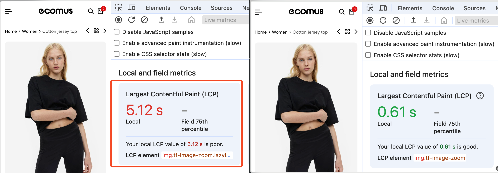

# LCP-optimization-demo

This is a demo project used to demonstrate the LCP debugging and optimization flow. 



## Setup

```
npm install
npm run start
```

## How to work with the project?

Please refererence [workshop book](https://github.com/kirillkuts/LCP-optimization-demo/blob/main/Module%203.%20Practice%20LCP%20optimization.pdf) to follow along with the instructor, or consult the `optimized` branch commit history for a list of the changes.

